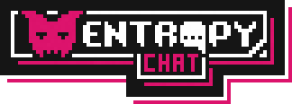

A discord clone made by the Coding Garden Community.

https://entropychat.app

## Tech Stack

* Frontend
  * Vue.js / Vuex / Vue Router
  * SCSS
  * FeathersJS Client
* Backend
  * FeathersJS / Socket.io / Express
* Login
  * Github OAuth

## Configuration / Setup

* Copy the [server/.env.sample](server/.env.sample) file to `server/.env` and update the values.
  * You can obtain a github client id and secret here:
    * https://github.com/settings/applications/new
  * The authorization callback URL should be set to:
    * http://localhost:3030/oauth/github/callback
      * Change the port if your feathers backend is running on a different port
* The oauth flow requires that the client is running at:
  * http://localhost:8080
  * If your client is running on a different port, you will need to update [server/public/index.html](server/public/index.html) to allow sending messages to the correct port / origin

## Design

* Designed by [cccccccccccccccccnrd](https://github.com/cccccccccccccccccnrd)
* View the initial designs [here](https://imgur.com/a/qVUab5w)

## Assets

* Icon, Logo and Loading image created by [shidotmoe](https://github.com/ShiDotMoe)

 All assets are licensed under a <a rel="license" href="http://creativecommons.org/licenses/by-nc-sa/4.0/">Creative Commons Attribution-NonCommercial-ShareAlike 4.0 International License</a>.
