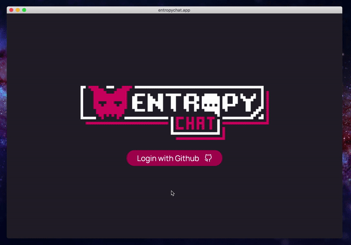

A discord clone made by the Coding Garden Community.

https://entropychat.app

## Tech Stack

* Frontend
  * Vue.js / Vuex / Vue Router
  * SCSS
  * FeathersJS Client
* Backend
  * FeathersJS / Socket.io / Express
* Login
  * Github OAuth

## Server Setup

* Copy the `.env.sample` file to `.env` and update the values.
  * You can obtain a github client id and secret here:
    * https://github.com/settings/applications/new
  * The authorization callback URL should be set to:
    * http://localhost:3030/oauth/github/callback
    * Change the port if your feathers backend is running on a different port

## Client Setup

* The oauth flow requires that the client is running at:
  * http://localhost:8080

## Credits

* Name / Logo / favicon by [shidotmoe](https://www.twitch.tv/shidotmoe)
* Design / layout by [cccccccccccccccccnrd](https://github.com/cccccccccccccccccnrd)
